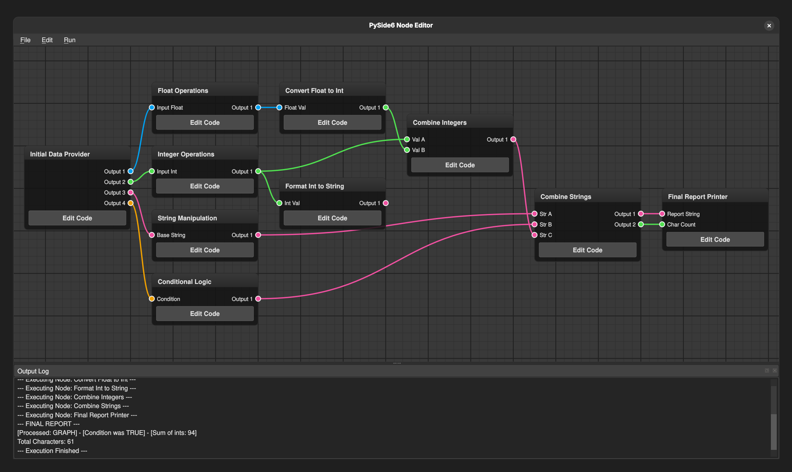
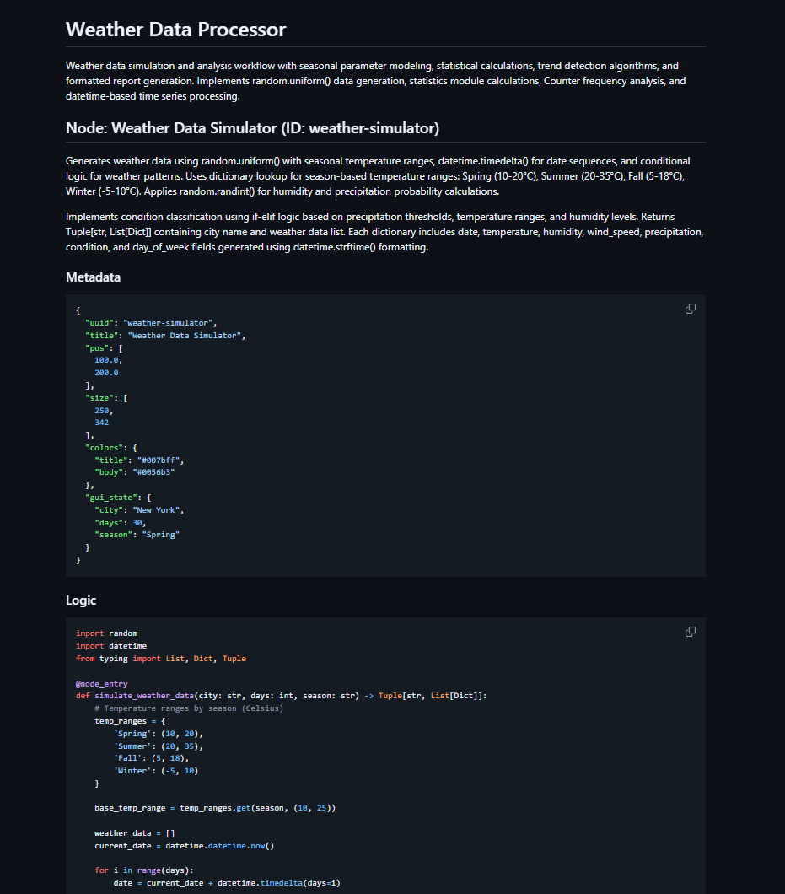
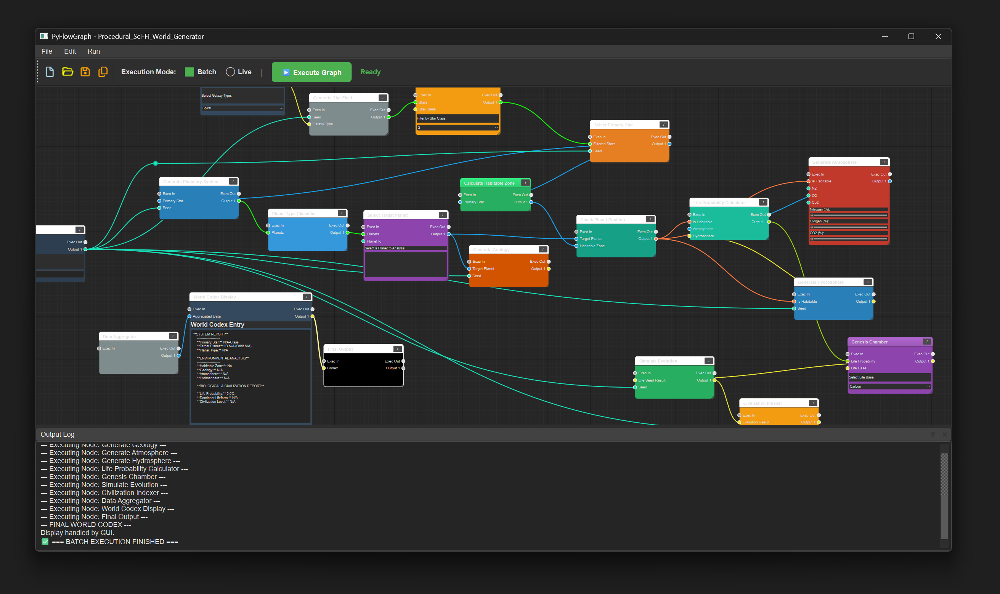
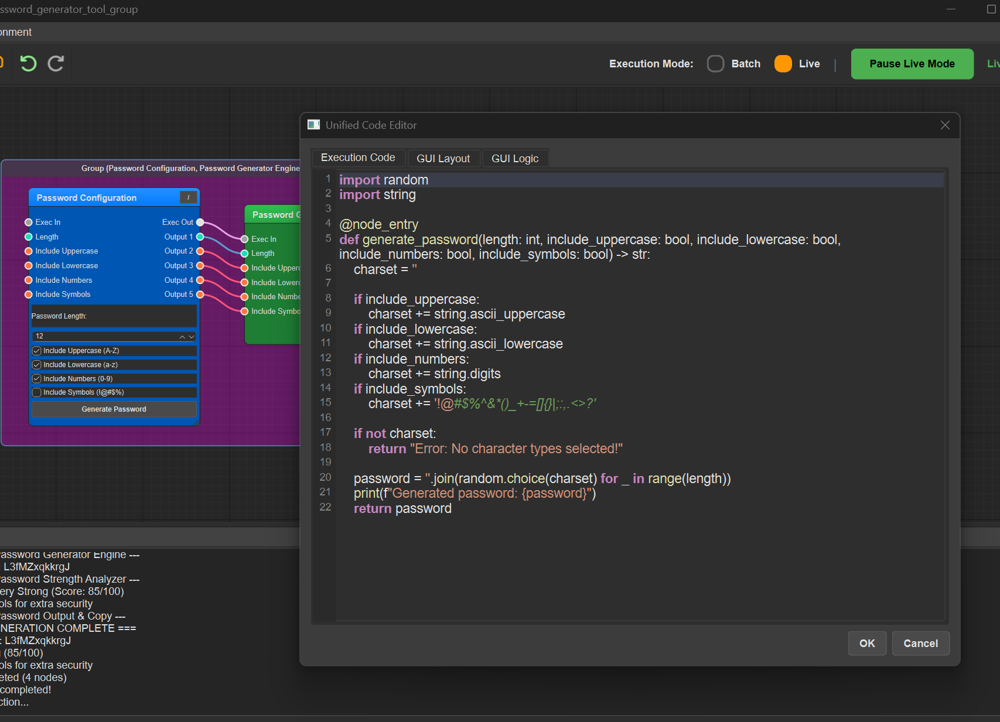
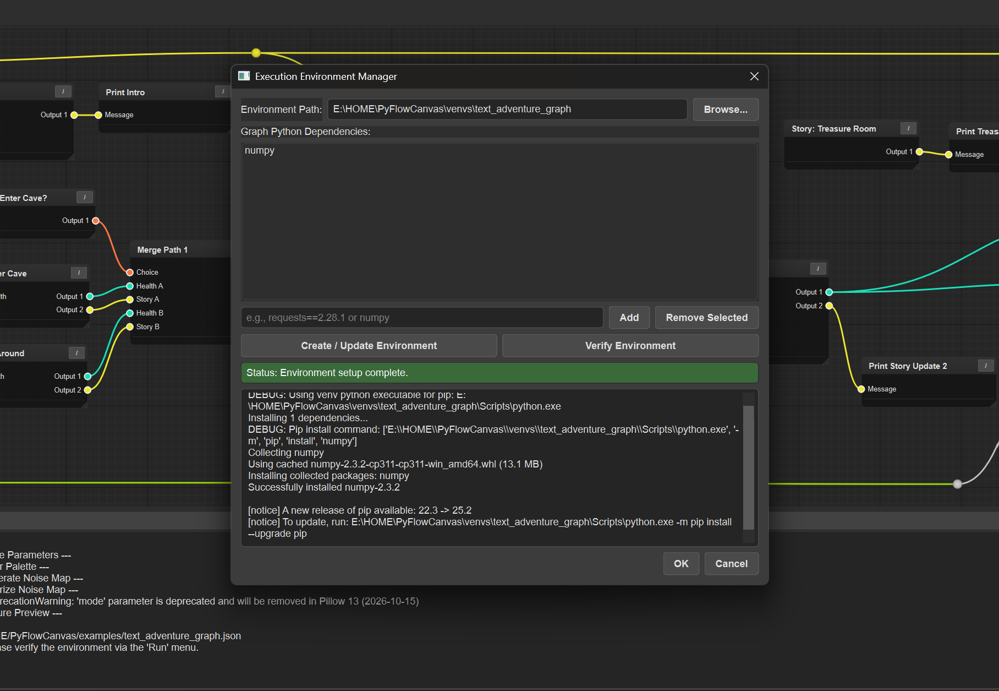

# PyFlowGraph

A universal, node-based visual scripting editor built with Python and PySide6 that bridges traditional data-flow programming with interactive application development. Create, connect, and execute Python code as nodes using either batch processing for data pipelines or live event-driven execution for interactive applications.



PyFlowGraph implements a **hybrid execution model** that combines two powerful paradigms:

* **Batch Mode**: Traditional data-flow execution where the entire graph processes data sequentially based on dependencies - perfect for data processing pipelines, transformations, and analytical workflows
* **Live Mode**: Event-driven interactive execution with persistent state and real-time event handling - ideal for building interactive applications, dashboards, games, and reactive systems

This dual approach makes PyFlowGraph uniquely versatile - use the same visual programming environment to build everything from data analysis pipelines to interactive tools and games. The application provides a Qt-based interface for creating and connecting Python functions as nodes in a directed graph, with automatic pin generation from function signatures and type annotations.

The core architecture follows a **"Code as Nodes"** philosophy where each node contains actual Python code that can be edited in a built-in IDE. Input and output pins are automatically generated by parsing function signatures and type hints, eliminating manual configuration while maintaining type safety. The innovative Markdown-based file format (.md) stores graphs in a human-readable format that can be version controlled, edited manually, and even processed by AI assistants and LLMs.

---

## Features

* **Dynamic Node Generation**: Pins are created automatically by parsing Python function signatures within each node. Type hints (`int`, `str`, `float`, `bool`, `Tuple`) define the data type and color of each pin.
* **Blueprint-Style Navigation**:
  * **Pan**: Right-click + Drag or Middle-click + Drag.
  * **Zoom**: Mouse Wheel Scroll.
  * **Select/Move**: Left-click to select and drag nodes.
* **Hybrid Execution Engine**:
  * **Batch Mode**: Traditional execution where the entire graph runs sequentially based on data dependencies
  * **Live Mode**: Interactive execution with real-time event handling and persistent state for building interactive applications
* **Event-Driven Interactive System**: Built-in event system supporting button clicks, timers, value changes, and user input for creating interactive experiences
* **Isolated Execution Environment**: Each node runs in its own subprocess with isolated virtual environments for maximum security and dependency management
* **Mini-IDE Code Editor**:
  * A modal dialog provides a spacious and professional coding environment.
  * **Syntax Highlighting** for Python with custom color schemes.
  * **Line Numbering** and **Smart Auto-Indentation**.
  * **Tab support** and professional editing features.
* **Advanced Connection Management**:
  * **Reroute Nodes**: Double-click a connection to create a reroute node for better graph organization.
  * **Connection Replacement**: Dragging a new wire to an already connected input pin automatically replaces the old connection.
  * **Type-Safe Connections**: Pin colors indicate data types for visual type checking.
* **Intelligent Clipboard System**:
  * Copy (`Ctrl+C`) and paste (`Ctrl+V`) multiple nodes with preserved relationships.
  * Internal connections between copied nodes are maintained automatically.
  * Smart positioning system offsets pasted nodes based on cursor location.
* **Professional UI/UX**:
  * **Custom Dark Theme**: Consistent, modern QSS stylesheet throughout the application.
  * **Font Awesome Integration**: Professional iconography for all UI elements.
  * **Blueprint-Style Navigation**: Industry-standard node editor interaction patterns.
* **Robust Persistence**: Graphs serialize to human-readable Markdown format with embedded metadata, making files both machine-readable and easily editable by humans. Full state preservation including node positions, connections, code, and environment requirements. All file operations use UTF-8 encoding for proper international character support.
* **Dynamic Interface**: Window title automatically updates to display the current graph name for better project identification.

---

## Markdown File Format

PyFlowGraph uses a innovative Markdown-based file format (`.md`) that combines human readability with structured data storage. This format makes graphs both machine-readable for the application and easily editable by humans or AI assistants. The format includes embedded metadata for node positions, connections, and execution requirements while presenting the code in a clean, readable format.



For detailed information about the file format specification, see [flow_spec.md](flow_spec.md).

### Example Graphs

The `examples/` directory contains sample graphs demonstrating various capabilities:

* [`data_analysis_dashboard.md`](examples/data_analysis_dashboard.md) - Interactive data visualization dashboard
* [`file_organizer_automation.md`](examples/file_organizer_automation.md) - Automated file organization system
* [`interactive_game_engine.md`](examples/interactive_game_engine.md) - Interactive game with event-driven execution
* [`password_generator_tool.md`](examples/password_generator_tool.md) - Secure password generation utility
* [`personal_finance_tracker.md`](examples/personal_finance_tracker.md) - Personal finance management system
* [`recipe_nutrition_calculator.md`](examples/recipe_nutrition_calculator.md) - Recipe analysis and nutrition calculator
* [`social_media_scheduler.md`](examples/social_media_scheduler.md) - Social media content scheduling tool
* [`text_processing_pipeline.md`](examples/text_processing_pipeline.md) - Advanced text processing workflow
* [`weather_data_processor.md`](examples/weather_data_processor.md) - Weather data analysis and processing

---

## Screenshots

### Main Interface

The main PyFlowGraph interface showcasing a complete text adventure game implementation. This example demonstrates the node-based visual scripting approach with interconnected nodes handling game logic, user input processing, and narrative flow. Notice the clean dark theme, type-colored connection pins, and the intuitive layout of the node graph canvas.



### Mini-IDE Code Editor

The integrated Python code editor provides a professional development environment within PyFlowGraph. Features include syntax highlighting with custom color schemes, line numbering, smart auto-indentation, and tab support. The modal dialog design gives developers ample space to write and edit node logic while maintaining the visual context of the graph workflow.



### Python Environment Manager

The Python Environment Manager dialog enables sophisticated dependency management for each graph project. Users can specify custom pip requirements that are automatically installed in isolated virtual environments. This ensures each graph has its own clean dependency space, preventing conflicts between different projects while maintaining security through subprocess isolation.



## Project Structure

The project is organized into modular, single-responsibility Python files:

### Core Application Files
* `main.py`: The main entry point for the application. Handles application setup and loads the stylesheet.
* `dark_theme.qss`: The global Qt Style Sheet that defines the application's dark theme.
* `node_editor_window.py`: The main `QMainWindow` that hosts all UI elements.
* `node_editor_view.py`: The `QGraphicsView` responsible for rendering the scene and handling all mouse/keyboard interactions (panning, zooming, copy/paste).
* `node_graph.py`: The `QGraphicsScene` that manages all nodes, connections, and the core clipboard logic.

### Node System
* `node.py`: Defines the main Node class, including its visual appearance and the logic for parsing Python code to generate pins.
* `pin.py`: Defines the input/output pins on a node.
* `connection.py`: Defines the visual Bezier curve connection between two pins.
* `reroute_node.py`: A special, simple node for organizing connections.

### Execution & Code Management
* `graph_executor.py`: The engine that intelligently executes the node graph based on data dependencies.
* `code_editor_dialog.py`: The modal dialog window that contains the advanced code editor.
* `python_code_editor.py`: The core code editor widget, featuring line numbers and smart indentation.
* `python_syntax_highlighter.py`: Implements syntax highlighting for the code editor.
* `event_system.py`: Event-driven system for live mode and interactive execution.

### Command System
* `commands/`: Directory containing command pattern implementation for undo/redo functionality
  * Command base classes and specific command implementations
  * Node, connection, and reroute operations

### Utilities & Configuration
* `color_utils.py`: Color manipulation utilities for the interface.
* `environment_manager.py`: Virtual environment management dialog for graph-specific dependencies.
* `settings_dialog.py`: Application settings configuration interface.
* `node_properties_dialog.py`: Node property editing interface.
* `run.sh` / `run.bat`: Helper scripts for running the application within its virtual environment.
* `run_test_gui.bat`: Professional GUI test runner launcher.

---

## Running the Pre-compiled Version (Windows)

This is the easiest way to run the application without needing to install Python or any dependencies.

1. **Go to the [Releases Page](https://github.com/bhowiebkr/PyFlowGraph/releases)** on GitHub.
2. Find the latest release and download the `.zip` file (e.g., `NodeEditor_Windows_v1.0.0.zip`).
3. **Unzip** the downloaded file to a location of your choice. This will create a new folder.
4. Open the new folder and run the `main.exe` executable.
5. To test the application, go to `File > Load Graph...` and open one of the `.md` files from the `examples` folder.

---

## Setup and Installation

1. **Clone the Repository**:

    ```bash
    git clone [https://github.com/bhowiebkr/PyFlowGraph.git](https://github.com/bhowiebkr/PyFlowGraph.git)
    cd PyFlowGraph
    ```

2. **Create a Virtual Environment**:

    ```bash
    python3 -m venv venv
    ```

3. **Activate the Environment**:
    * On Linux/macOS: `source venv/bin/activate`
    * On Windows: `venv\Scripts\activate`

4. **Install Dependencies**:

    ```bash
    pip install PySide6
    ```

5. **Run the Application**:
    Use the provided scripts, which will automatically activate the environment and run the main script.

    **Linux/macOS:**

    ```bash
    ./run.sh
    ```

    **Windows:**

    ```cmd
    run.bat
    ```

---

## Quick Start Guide

### Basic Operations

* **Create a Node**: Right-click on the canvas and select "Add Node"
* **Edit Node Logic**: Click the "Edit Code" button on a node to open the integrated code editor
* **Connect Nodes**: Click and drag from an output pin (right side) to an input pin (left side)
* **Navigate**:
  * **Pan**: Right-click + drag or middle-click + drag
  * **Zoom**: Mouse wheel scroll
  * **Select/Move**: Left-click to select and drag nodes
* **Delete Items**: Select any node, reroute node, or connection and press `Delete`
* **Execute Graph**:
  * **Batch Mode**: Press `F5` or use "Run > Execute Graph" menu
  * **Live Mode**: Select "Live" mode and click "Start Live Mode" for interactive execution

### Execution Modes

* **Batch Mode**: Execute entire graph at once with traditional data-flow execution
* **Live Mode**: Interactive mode with persistent state and event-driven execution for building interactive applications
* **Event System**: Built-in support for user interactions, timers, and custom triggers within nodes

### Advanced Features

* **Reroute Connections**: Double-click any connection to create an organizational reroute node
* **Copy/Paste**: Use `Ctrl+C` and `Ctrl+V` to duplicate node selections with preserved connections
* **Environment Management**: Access "Run > Manage Environment" to configure pip dependencies
* **Save/Load**: Use "File" menu to save graphs as Markdown or load example projects
* **Dynamic Window Titles**: Window title automatically updates to show the current graph name

### Testing the Application

1. Load an example: "File > Load Graph..." and select from the `examples/` folder
2. Try the `interactive_game_engine.md` for an interactive demonstration of Live Mode
3. Select execution mode: **Batch Mode** for traditional execution or **Live Mode** for interactive applications
4. Press `F5` (Batch) or "Start Live Mode" (Live) to execute and see results in the Output Log panel
5. Notice how the window title updates to show the current graph name

---

## Node Scripting Guide

The power of this editor comes from its function-based node definition. The editor parses the first function it finds in a node's code to determine its I/O pins.

### Defining Inputs

Inputs are defined as parameters to your function. The parameter's **name** and **type hint** are used to create the input pin.

```python
# This creates an input pin named "Input Number" of type Float.
def my_function(input_number: float):
    ...
```

### Defining Outputs

Outputs are defined by the function's **return type hint**.

**Single Output:**

```python
# This creates a single output pin named "Output 1" of type String.
def my_function(input_value: int) -> str:
    return f"The value is {input_value}"
```

**Multiple Outputs:**
Use a `Tuple` to define multiple output pins. The editor will create `output_1`, `output_2`, etc.

```python
from typing import Tuple

# Creates two output pins:
# - "Output 1" (String)
# - "Output 2" (Integer)
def my_function(input_value: str) -> Tuple[str, int]:
    return f"Processed: {input_value}", len(input_value)
```

### Helper Functions & Imports

You can define helper functions and import modules at the top level of your code. They will be available to your main node function during execution.

```python
import random

def get_random_suffix() -> str:
    return str(random.randint(100, 999))

def main_node_function(base_name: str) -> str:
    suffix = get_random_suffix()
    return f"{base_name}_{suffix}"
```

### Advanced Features

**Custom Dependencies**: Each graph can specify its own pip requirements through the Environment Manager. Dependencies are automatically installed in isolated virtual environments.

**Type Flexibility**: The editor supports any Python type through type hints for automatic pin generation. Pin colors are determined by the type annotation, providing visual type identification. Common types include:

* `int` - Integer values (blue pins)
* `str` - String values (green pins)
* `float` - Floating point numbers (orange pins)
* `bool` - Boolean values (red pins)
* `Tuple[type, ...]` - Multiple outputs (colored by constituent types)
* Custom classes, complex data structures, and any Python object are fully supported

**Error Handling**: Node execution errors are captured and displayed in the Output Log with full stack traces for debugging.

---

## Virtual Environment Management

PyFlowGraph features advanced virtual environment management:

* **Isolated Environments**: Each graph can have its own virtual environment with custom pip dependencies
* **Automatic Management**: The application creates project-specific environments in the `venvs/` directory
* **Environment Dialog**: Use "Run > Manage Environment" to configure package dependencies for each graph
* **Security**: All node execution happens in isolated subprocess environments

---

## Testing

PyFlowGraph includes a comprehensive testing suite with a professional GUI test runner:

### Running Tests

**GUI Test Runner (Recommended)**:
```batch
run_test_gui.bat
```
* Professional PySide6 test interface with visual test selection
* Real-time pass/fail indicators with detailed output viewing
* Background execution with progress tracking

**Manual Test Execution**:
```bash
python tests/test_name.py
```

### Test Coverage

The test suite includes 18+ test files covering:
* **Core Components**: Node system, pins, connections, graph management
* **Execution Engine**: Code execution, data flow, subprocess isolation
* **File Formats**: Markdown/JSON parsing, serialization, file operations
* **Command System**: Undo/redo functionality with command pattern
* **Integration**: End-to-end workflows and real-world usage scenarios
* **GUI Operations**: Node deletion, view state persistence, user interactions

---

## Documentation

Comprehensive documentation is available in the `docs/` directory:

### Documentation Structure
* **[docs/README.md](docs/README.md)** - Documentation overview and navigation
* **Product Planning**: PRD, roadmap, competitive analysis
* **Architecture**: Technical architecture, coding standards, tech stack
* **Specifications**: Flow format spec, UI/UX specifications, feature priorities
* **Development**: Testing guide, implementation notes, fixes

### Key Documents
* **[Development Roadmap](docs/roadmap.md)** - Planned features and priorities
* **[Bug Tracking](docs/bugs/)** - Known issues and GitHub integration
* **[Testing Guide](docs/development/testing-guide.md)** - Complete testing documentation
* **[Flow Specification](docs/specifications/flow_spec.md)** - Markdown format specification

---

## Development Roadmap

### Priority 1: Feature Parity
* **Undo/Redo System** - Multi-level undo/redo with Command Pattern (partially implemented)
* **Node Grouping** - Collapsible subgraphs for managing complexity

### Priority 2: Performance & Usability
* **Shared Subprocess Execution** - 10-100x performance improvement
* **Pin Type Visibility** - Type badges and connection compatibility highlighting

### Priority 3: Advanced Features
* **Enhanced Debugging** - Breakpoints, step-through execution, live data inspection

See [full roadmap](docs/roadmap.md) for complete details.

---

## Known Issues

Active bugs are tracked in both local documentation and GitHub Issues:
* **Bug Reports**: Located in `docs/bugs/` directory
* **GitHub Issues**: [Project issue tracker](https://github.com/bhowiebkr/PyFlowGraph/issues)

Current high-priority issues include reroute node execution problems. See [bug documentation](docs/bugs/) for details.

---

## Dependencies

* **Python 3.8+**
* **PySide6** - Qt6 framework for Python
* **Font Awesome** - Professional iconography (included in `resources/`)

---

## Contributing

We welcome contributions to PyFlowGraph! Here's how you can help:

### Development Process
1. **Check Issues**: Review existing [GitHub Issues](https://github.com/bhowiebkr/PyFlowGraph/issues) or [bug documentation](docs/bugs/)
2. **Fork & Branch**: Create a feature branch from `main`
3. **Follow Standards**: Adhere to [coding standards](docs/architecture/coding-standards.md)
4. **Test Thoroughly**: Run the test suite with `run_test_gui.bat`
5. **Document Changes**: Update relevant documentation in `docs/`
6. **Submit PR**: Create a pull request with clear description

### Areas for Contribution
* **Bug Fixes**: Help resolve issues from the [bug tracker](docs/bugs/)
* **Feature Implementation**: Work on [roadmap items](docs/roadmap.md)
* **Testing**: Expand test coverage in the `tests/` directory
* **Documentation**: Improve and expand documentation
* **Examples**: Create new example graphs for the `examples/` directory

### Code Guidelines
* Follow PySide6/Qt best practices
* Maintain the single-responsibility principle for modules
* Include type hints for automatic pin generation
* Ensure compatibility with the Markdown file format
* Write tests for new features

---

## License

This project is licensed under the MIT License. See the `LICENSE` file for details.

---

## Support

<div align="center">

[](https://buymeacoffee.com/bryanhoward)

*If PyFlowGraph has been helpful to you, consider supporting its development!*

</div>
