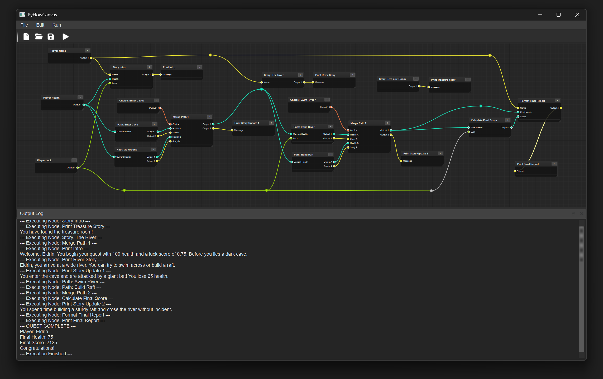

# PyFlowCanvas (PySide6 Advanced Node Editor)

> **Note: This is a 100% AI-Generated Coding Experiment**
>
> This codebase is a [Vibe coding](https://en.wikipedia.org/wiki/Vibe_coding) experiment, generated entirely with the assistance of Google's Gemini large language model (2.5 Pro). It is not intended for production use. The primary goal is to test and learn the capabilities of AI/ML-fully assisted code generation and guidance. While I have made an effort to cover edge cases, there are likely many bugs that I am not aware of. Even this README file may contain errors or inconsistencies.


This project is a universal implementation of a node-based Python environment. It provides a highly interactive and visually polished interface for creating, connecting, and executing custom logic nodes. The application is designed to handle any Python code, including scripts with embedded pip dependencies. The compiled application is fully self-contained and includes a portable Python runtime, so users do not need to have Python installed on their system.

The core philosophy of this editor is **"Code as Nodes."** Instead of manually adding inputs and outputs, the editor intelligently parses the Python code within each node to dynamically generate the appropriate connection pins, making graph creation fast, flexible, and intuitive.

---

## Features

* **Dynamic Node Generation**: Pins are created automatically by parsing Python function signatures within each node. Type hints (`int`, `str`, `float`, `bool`, `Tuple`) define the data type and color of each pin.
* **Blueprint-Style Navigation**:
  * **Pan**: Right-click + Drag or Middle-click + Drag.
  * **Zoom**: Mouse Wheel Scroll.
  * **Select/Move**: Left-click to select and drag nodes.
* **Data-Driven Execution Engine**: The graph executes based on data dependencies, flowing from nodes with available outputs to those that require them as inputs. No manual execution pins are needed.
* **Mini-IDE Code Editor**:
  * A modal dialog provides a spacious and professional coding environment.
  * **Syntax Highlighting** for Python.
  * **Line Numbering**.
  * **Smart Auto-Indentation** and Tab support.
* **Advanced Connection Management**:
  * **Reroute Nodes**: Double-click a connection to create a reroute node for better graph organization.
  * **Connection Replacement**: Dragging a new wire to an already connected input pin automatically replaces the old connection.
* **Clipboard Support**:
  * Copy (`Ctrl+C`) and paste (`Ctrl+V`) multiple nodes.
  * Internal connections between copied nodes are preserved.
  * Pasted nodes are intelligently offset based on cursor position.
* **Professional Dark Theme**: The entire application is styled with a custom QSS stylesheet for a consistent, modern, and visually appealing dark theme.
* **Save & Load**: Graphs can be serialized to and deserialized from a clean JSON format.

---

## Screenshots

### Main Interface



### Mini-IDE Code Editor


---

## Project Structure

The project is organized into modular, single-responsibility Python files:

* `main.py`: The main entry point for the application. Handles application setup and loads the stylesheet.
* `dark_theme.qss`: The global Qt Style Sheet that defines the application's dark theme.
* `node_editor_window.py`: The main `QMainWindow` that hosts all UI elements.
* `node_editor_view.py`: The `QGraphicsView` responsible for rendering the scene and handling all mouse/keyboard interactions (panning, zooming, copy/paste).
* `node_graph.py`: The `QGraphicsScene` that manages all nodes, connections, and the core clipboard logic.
* `node.py`: Defines the main Node class, including its visual appearance and the logic for parsing Python code to generate pins.
* `pin.py`: Defines the input/output pins on a node.
* `connection.py`: Defines the visual Bezier curve connection between two pins.
* `reroute_node.py`: A special, simple node for organizing connections.
* `graph_executor.py`: The engine that intelligently executes the node graph based on data dependencies.
* `code_editor_dialog.py`: The modal dialog window that contains the advanced code editor.
* `python_code_editor.py`: The core code editor widget, featuring line numbers and smart indentation.
* `python_syntax_highlighter.py`: Implements syntax highlighting for the code editor.
* `socket_type.py`: An `Enum` that defines the data types and their corresponding colors.
* `default_graphs.py`: Contains the function to generate the complex example graph on startup.
* `run.sh`: A helper script for running the application within its virtual environment.

---

## Running the Pre-compiled Version (Windows)

This is the easiest way to run the application without needing to install Python or any dependencies.

1. **Go to the [Releases Page](https://github.com/bhowiebkr/PyFlowCanvas/releases)** on GitHub.
2. Find the latest release and download the `.zip` file (e.g., `NodeEditor_Windows_v1.0.0.zip`).
3. **Unzip** the downloaded file to a location of your choice. This will create a new folder.
4. Open the new folder and run the `main.exe` executable.
5. To test the application, go to `File > Load Graph...` and open one of the `.json` files from the `examples` folder.

---

## Setup and Installation

1. **Clone the Repository**:

    ```bash
    git clone [https://github.com/bhowiebkr/PyFlowCanvas.git](https://github.com/bhowiebkr/PyFlowCanvas.git)
    cd PyFlowCanvas
    ```

2. **Create a Virtual Environment**:

    ```bash
    python3 -m venv venv
    ```

3. **Activate the Environment**:
    * On Linux/macOS: `source venv/bin/activate`
    * On Windows: `venv\Scripts\activate`

4. **Install Dependencies**:

    ```bash
    pip install PySide6
    ```

5. **Run the Application**:
    Use the provided shell script, which will automatically activate the environment and run the main script.

    ```bash
    ./run.sh
    ```

---

## How to Use

* **Create a Node**: Right-click on the canvas and select "Add Node."
* **Edit Node Logic**: Click the "Edit Code" button on a node to open the code editor.
* **Connect Nodes**: Click and drag from an output pin (right side of a node) to an input pin (left side).
* **Delete Items**: Select any node, reroute node, or connection and press the `Delete` key.
* **Execute the Graph**: Press `F5` or use the "Run > Execute Graph" menu option. The output will appear in the "Output Log" panel at the bottom.

---

## Node Scripting Guide

The power of this editor comes from its function-based node definition. The editor parses the first function it finds in a node's code to determine its I/O pins.

### Defining Inputs

Inputs are defined as parameters to your function. The parameter's **name** and **type hint** are used to create the input pin.

```python
# This creates an input pin named "Input Number" of type Float.
def my_function(input_number: float):
    ...
```

### Defining Outputs

Outputs are defined by the function's **return type hint**.

**Single Output:**

```python
# This creates a single output pin named "Output 1" of type String.
def my_function(input_value: int) -> str:
    return f"The value is {input_value}"
```

**Multiple Outputs:**
Use a `Tuple` to define multiple output pins. The editor will create `output_1`, `output_2`, etc.

```python
from typing import Tuple

# Creates two output pins:
# - "Output 1" (String)
# - "Output 2" (Integer)
def my_function(input_value: str) -> Tuple[str, int]:
    return f"Processed: {input_value}", len(input_value)
```

### Helper Functions & Imports

You can define helper functions and import modules at the top level of your code. They will be available to your main node function during execution.

```python
import random

def get_random_suffix() -> str:
    return str(random.randint(100, 999))

def main_node_function(base_name: str) -> str:
    suffix = get_random_suffix()
    return f"{base_name}_{suffix}"
```

---

## Dependencies

* **Python 3.8+**
* **PySide6**

---

## License

This project is licensed under the MIT License. See the `LICENSE` file for details.
